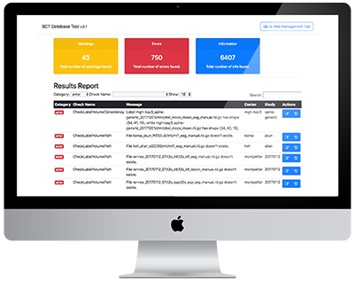

.. sct_dbtool documentation master file, created by
   sphinx-quickstart on Sat Jul  7 12:30:25 2018.
   You can adapt this file completely to your liking, but it should at least
   contain the root `toctree` directive.

SCT DB Tool documentation
=========================================
This is the website for the SCT DB Tool documentation. SCT DB Tool is an application
that contains tools such as sanity checking for the MRI database.

.. toctree::
   :maxdepth: 4
   :caption: Contents:

   getstarted
   modules

Indices and tables
==================

* :ref:`genindex`
* :ref:`modindex`
* :ref:`search`
